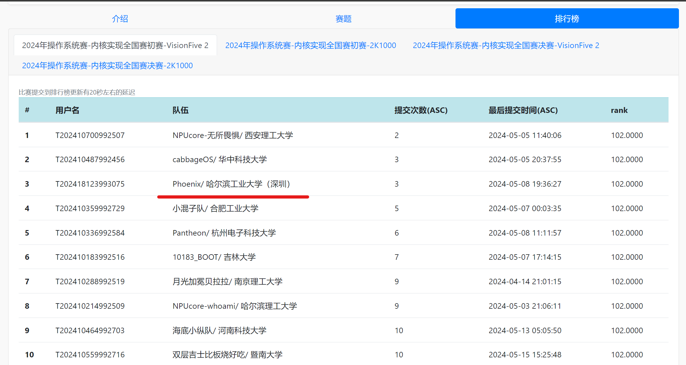

# Phoenix OS


## 项目描述

使用 Rust 编写、基于 RISCV-64 硬件平台、支持多核的模块化宏内核操作系统。

## 完成情况

### 初赛

VisionFive 2 赛道，初赛功能测试满分：



### Phoenix 内核介绍

- 进程管理：实现基本的进程与线程管理功能，支持多核运行。
- 内存管理：实现基本的内存管理功能。使用懒分配和 Copy-on-Write 优化策略。
- 文件系统：基于 Linux 设计的虚拟文件系统。实现页缓存加速文件读写，实现 Dentry 缓存加速路径查找。使用开源 `rust-fatfs`库提供对 fat32 文件系统的支持。
- 信号机制：完成基础的信号机制，支持用户自定义处理函数。

### 项目结构

```
.
├── arch/                   # 与平台相关的包装函数
├── config/                 # 配置常量
├── crates/                 # 自己编写的功能单一的库
│   ├── async_utils/
│   └── recycle_allocator/
├── docs/
├── driver/                 # 驱动模块
├── kernel/                 # 内核
│   ├── src/
│   │   ├── ipc/            # 进程间通信机制
│   │   ├── mm/             # 内存管理
│   │   ├── processor/      # 多核心管理
│   │   ├── syscall/        # 系统调用
│   │   ├── task/           # 进程管理
│   │   ├── trap/           # 异常处理
│   │   ├── utils/          # 工具
│   │   ├── boot.rs         # 内核启动
│   │   ├── impls.rs        # 模块接口实现
│   │   ├── link_app.asm
│   │   ├── loader.rs
│   │   ├── main.rs         # 入口函数
│   │   ├── panic.rs
│   │   └── trampoline.asm
│   ├── build.rs
│   ├── Cargo.toml
│   ├── linker.ld
│   └── Makefile

├── modules/                # 内核各个模块
│   ├── executor/           # 异步调度器
│   ├── fat32/              # fat32 文件系统支持
│   ├── futex/              # futex 机制
│   ├── logging/            # 日志系统
│   ├── memory/             # 基础内存模块
│   ├── signal/             # 基础信号模块
│   ├── sync/               # 同步原语
│   ├── systype/            # 系统调用类型
│   ├── time/               # 时间模块
│   ├── timer/              # 定时器模块
│   ├── vfs/                # 虚拟文件系统模块
│   └── vfs-core/           # 虚拟文件系统接口
├── testcase/               # 测试用例
├── third-party/
│   └── vendor/
├── user/                   # 用户程序
├── Cargo.lock
├── Cargo.toml
├── Dockerfile
├── LICENSE
├── Makefile
├── README.md
├── rustfmt.toml
└── rust-toolchain.toml
```

## 运行

1. 在项目根目录下，进入 root 用户，构建`docker`容器

```sh
make build_docker
```

2. 使用下列命令运行容器，进入容器终端

```sh
make docker
```

3. 第一次运行内核，需要下载依赖库并缓存在 `third-party/vendor` 文件夹下

```sh
make env
```

4. 编译内核，烧录文件镜像，并在`Qemu`中运行内核

```sh
make all
```
