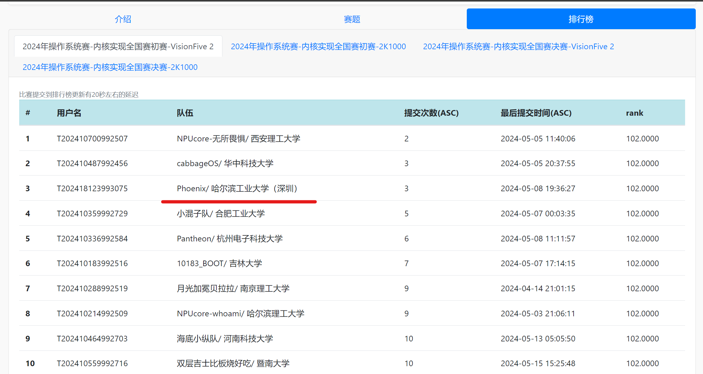

# Phoenix OS


Phoenix OS is a Unix-like OS for 2024 OS-Competition

## 项目描述

Rust编写的宏内核操作系统，基于RISC-V64硬件平台，支持多核

## 完成情况

### 初赛

VisionFive 2赛道，初赛功能测试满分



## 运行

确保在项目 `my_os` 根目录下

如果不在根用户下，先进入根用户

```sh
su
```

建议使用`docker`来编译和运行内核。第一次运行前, 构建`docker`容器，输入

```sh
make build_docker
```

`docker`容器只需要构建一次，之后所有的编译和运行都在容器里进行。

进入容器，输入

```sh
make docker
```

第一次运行内核，需要下载对应Rust工具链并生成vendor文件夹，输入命令

```sh
make env
```

构建并在`Qemu`中运行内核, 输入

```sh
make all
```

### `Makefile` 其他参数介绍

编译内核，输入

```sh
make kernel
```

编译应用代码，输入

```sh
make user
```

烧录文件系统镜像，输入

```sh
make fs-img
```

格式化代码&编译应用代码&烧录文件系统镜像&编译内核, 输入

```sh
make build
```

在`Qemu`中运行内核，输入

```sh
make run
```

或输入

```sh
make qemu
```

清除项目编译的二进制文件和烧录的文件镜像，输入

```sh
make clean
```

启动GDB服务器端, 输入

```sh
make gdbserver
```

启动GDB用户端，输入

```sh
make gdbclient
```

按照Rust官方推荐风格格式化项目代码，输入

```sh
make fmt
```
