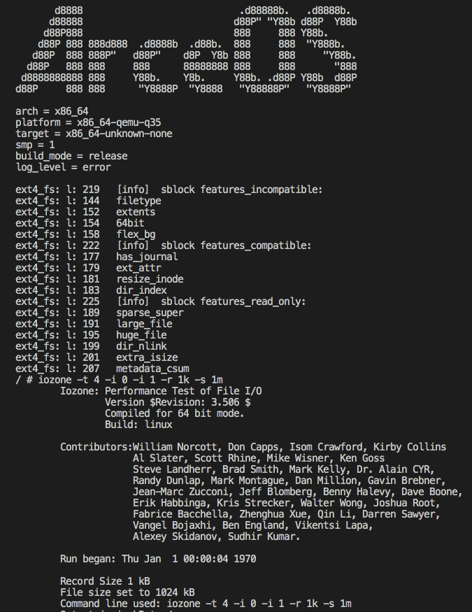

# lwext4 in Rust
To provide the rust interface, [lwext4](https://github.com/gkostka/lwext4.git) is abstracted in Rust language.

_lwext4 is an ext2/ext3/ext4 filesystem library in C for microcontrollers_

## Supported features

* `lwext4_rust` for x86_64, riscv64 and aarch64 on Rust OS is supported
* File system mount and unmount operations
* Filetypes: regular, directories, softlinks
* Journal recovery & transactions
* memory as Block Cache

## Quick start on Rust OS


### Wrap up the file operations
Wrap up the file operation struct `Ext4File`.
It can provide the file system interfaces for the upper layer of Rust OS.

For the specific code, please refer to [ext4fs.rs](https://github.com/elliott10/arceos/blob/ext4-starry-x86_64/modules/axfs/src/fs/ext4fs.rs)

`Ext4File` operations include: `file_read`, `file_write`, `file_seek`, `file_open`, `file_close`, `file_rename`, `lwext4_dir_entries` ...

### Implement interface for disk operations
These operate the physical disk through the interface of disk driver.

``` rust
impl KernelDevOp for Disk {
    type DevType = Disk;
    fn read() {}
    fn write() {}
    fn seek() {}
    fn flush() {}
}
```

### Create a file system object
New a file system object, initialize and mount the ext4 file system.

``` rust
let ext4fs = 
Ext4BlockWrapper::<Disk>::new(disk).expect("failed to initialize EXT4 filesystem");
```

### Compile lwext4_rust separately

``` sh
cargo build -vv --target x86_64-unknown-none | riscv64gc-unknown-none-elf | aarch64-unknown-none-softfloat
```
OR If you need to compile the lwext4 in C separately, 

please run `make musl-generic -C c/lwext4 ARCH=<x86_64|riscv64|aarch64>`

## Dependencies
* Rust development environment
* C musl-based cross compile toolchains
	- [x86_64-linux-musl-gcc](https://musl.cc/x86_64-linux-musl-cross.tgz)
	- [riscv64-linux-musl-gcc](https://musl.cc/riscv64-linux-musl-cross.tgz)
	- [aarch64-linux-musl-gcc](https://musl.cc/aarch64-linux-musl-cross.tgz)

## Reference

<!--  -->
* [lwext4](https://github.com/gkostka/lwext4.git)
* [arceos-lwip](https://github.com/Centaurus99/arceos-lwip.git)
